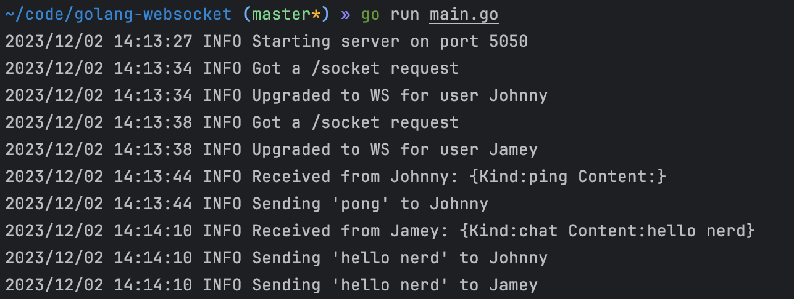

# WS Server in Golang

A crude implementation of a WS server in Golang.

It supports two kinds of payloads:
`{"kind": "ping"}` and `{"kind": "chat", "content": "blahblah"}`.

Kind == "ping" does a "pong" reply.

Kind == "chat" does a broadcast to all connected clients.

Example logs:
